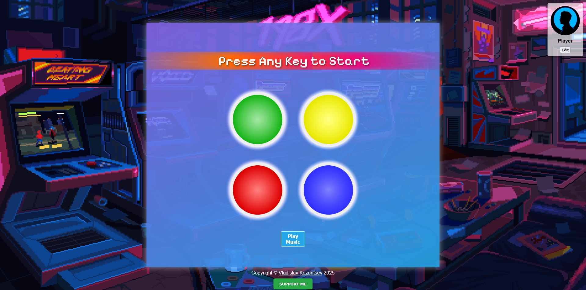

# Simon Game 🎮

&nbsp;&nbsp;Welcome to the **Simon Game**! This interactive web application challenges players to press the correct colored buttons. It's a fun way to spend your time!

- [Simon Game 🎮](#simon-game-)
  - [Features](#features)
  - [Technologies Used](#technologies-used)
  - [Interface](#interface)
  - [Installation](#installation)
  - [Usage](#usage)
  - [Support My Work ☕](#support-my-work-)
  - [Contact Me 💬](#contact-me-)

## Features

- **Interactive Gameplay**: press the colored buttons to match the sequence.
- **Background Music**: enjoy an engaging audio experience while playing.
- **Responsive Design**: works seamlessly on various devices.

## Technologies Used

- JavaScript.
- HTML.
- CSS.
- jQuery: a fast, small, and feature-rich JavaScript library.
- Google Fonts: a stylish font used for the game's text.

## Interface

&nbsp;&nbsp;The interface is designed to be user-friendly and visually appealing.


_The Simon Game Interface_

## Installation

&nbsp;&nbsp;To get started with the Simon Game, follow these steps:

**For Windows**

1. Open Command Prompt (cmd) or PowerShell.

2. Clone the repository:

```bash
git clone https://github.com/PrimeSolar/simon-game.git
```

3. Navigate to your project directory where the index.html file is located:

**Note**
&nbsp;&nbsp;Make sure to replace path/to/the/shopping-app with the actual path to your project directory.

```bash
cd path\to\the\simon-game
```

4. Open the index.html file in your default web browser:

```bash
start index.html
```

**For macOS**

1. Open Terminal.

2. Clone the repository:

```bash
git clone https://github.com/PrimeSolar/simon-game.git
```

3. Navigate to your project directory where the index.html file is located:

**Note**
&nbsp;&nbsp;Make sure to replace path/to/the/shopping-app with the actual path to your project directory.

```bash
cd path/to/the/simon-game
```

4. Open the index.html file in your default web browser:

```bash
open index.html
```

**For Linux**

1. Open Terminal.

2. Clone the repository:

```bash
git clone https://github.com/PrimeSolar/simon-game.git
```

3. Navigate to your project directory where the index.html file is located:

**Note**
&nbsp;&nbsp;Make sure to replace path/to/the/shopping-app with the actual path to your project directory.

```bash
cd path/to/the/simon-game
```

4. Open the index.html file in your default web browser:

```bash
xdg-open index.html
```

&nbsp;&nbsp;After completing these steps, your default web browser should open and display the index.html webpage.

## Usage

1. Open the game in your browser.
2. Press any key to start.
3. Follow the prompts and press the corresponding colored buttons.
4. Use the "Play Music" button to toggle background music.

## Support My Work ☕

&nbsp;&nbsp;If you enjoy my project and would like to support my work, consider buying me a coffee! Your contributions help me stay energized and motivated to create even more amazing content.

&nbsp;&nbsp;Every cup of coffee you buy not only fuels my passion but also allows me to dedicate more time to developing innovative projects and sharing knowledge. Whether it's a small gesture or a generous contribution, every bit is greatly appreciated!

**Click the image to support my work:**

<a href="https://coff.ee/cocacola">
  
</a>

&nbsp;&nbsp;Thank you for your support! Together, we can create something wonderful! 💖

**Copyright Notice**

Copyright © Vladislav Kazantsev
All rights reserved.
This repository contains the intellectual property of Vladislav Kazantsev, including the code and related files.
You are welcome to clone this repository and use the code for exploratory purposes.
However, unauthorized reproduction, modification, or redistribution of this code (including cloning of this repository or altering it for activities beyond exploratory use) is strictly prohibited.
Code snippets may be shared only when the original author is explicitly credited and a direct link to the original source of the code is provided alongside the code snippet.
Sharing links to the repository or its files is permitted, except when directed toward retrieval purposes.
Any form of interaction with this repository or its files is strictly prohibited when facilitated by the code, except when such interaction is for discussion or exchange purposes with others.
This copyright notice applies globally.
Email address for inquiries about collaboration, usage outside exploratory purposes, or permissions: [hypervisor7@pm.me](mailto:hypervisor7@pm.me)

<a name="contact-me"></a>

## Contact Me 💬

&nbsp;&nbsp;LinkedIn [@PepsiCo](https://www.linkedin.com/in/PepsiCo/)


